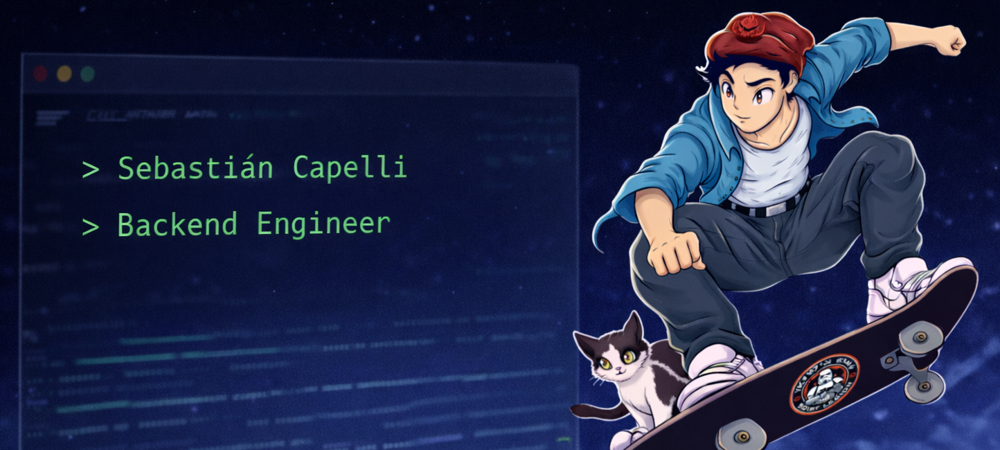

<h1 align="center">Hi, I'm Sebastián.</h1>

Backend Software Engineer focused on scalable systems and technical leadership.

  

 

## What I Do

- Design and build RESTful APIs  
- Define system architecture and data models  
- Develop scalable backend services  
- Lead technical teams and deliver production-ready software  

---

## Core Stack

Python · Flask · SQLAlchemy · MySQL · AWS · Docker · React · Next.js · TypeScript  

---

## Contact

- 🌐 Portfolio: https://www.scapelli.com  
- 📄 CV: https://www.scapelli.com/cv-en-CAPELLI.pdf  
- 💼 LinkedIn: https://www.linkedin.com/in/scapelli  
- ✉️ scapelli@fi.uba.ar
